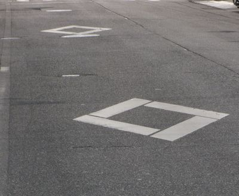

# detectnet-diamond.py
## Jetson nano warns safty diamond-shaped symbols near the pedestrian crossing in Japan
#
In Japan, two diamond-shaped symbols known as "dia-mark" are printed on the road 50m 
before the pedestrian crossing to warn vehicle drivers that pedestrians 
crossing at crosswalks without signals.  
Vehicles must stop if there are pedestrians attempting to cross. 
However, vehicles do not notice the diamond-shaped symbols and approach 
the pedestrian crossing at a dangerous speed. 

detectnet-diamond.py uses a Jetson nano and a USB camera to 
detect the diamond-shaped symbols (diamond) and outputs the rising pulse to GPIO38 where ISD1802 board is connected.

ISD1820 is a board that can record audio for max 10 seconds and plays back 
the audio if the rising pulse enters the PlayE terminal. 
If you record the appropriate voice such as barking dog , it will tell you audibly when 
Jetson nano recognizes the diamond-shaped symbols.




The first time it starts up, it takes about 10 minutes to run [TRT] 
TensorRT and starts recognition, but after the first time, 
it takes about 30 seconds to recognize the diamond-shaped symbols.

This program is derived from https://github.com/dusty-nv/jetson-inference/blob/master/python/examples/detectnet.py


## Hard ware : 
Jetson nano 2GB
  
logi C270n USB camera 

ISD1820 voice recorder board 

USB GPS : EPS32 with NEO6M GPS board or GPS module for M5stack.

ESP32 is programed to send NMEA to USB serial port.
          https://github.com/coniferconifer/ESP32-GPS-BTserial

```
pin Number 33 (gpio38) at J41 connector should be wired to ISD1820 PlayE(PE) pin
pin Number 2,4 can be used as VCC supply to ISD1820
any of one of pin Number 6,9,14,20,25,30,34,39 can be used as GND for ISD1820
```
https://jetsonhacks.com/nvidia-jetson-nano-j41-header-pinout/

If the system reacts incorrectly when the vehicle stops, it will continue to react for a long time, so the system uses the vehicle speed obtained from the GPS to recognize the vehicle at a speed of 30 km/h or more. (speedThresh)
Also, since Jetson nano is not equipped with a battery-backed RTC, it is not possible to get a time that can be used for logging in environments without an Internet connection, so the time is obtained from GPS.

default TIMEZONE is JST

## How to set up GPS and ntpd

```
$ sudo apt install gpsd
$ sudo apt install ntp
$ sudo systemctl stop systemd-timesyncd
$ sudo systemctl disable systemd-timesyncd
```

edit /etc/ntp.conf and add following lines to sync with GPS time. 
```
server 127.127.28.0  minpoll 4 maxpoll 4 prefer
fudge 127.127.28.0 flag1 1 time1 0.0 refid GPS
```
reboot and  confirm ntpd and gpsd are running
```
$ sudo reboot now
$ cgsp -s
$ ntpq -p
ntpq -p
     remote           refid      st t when poll reach   delay   offset  jitter
==============================================================================
*SHM(0)          .GPS.            0 l   14   16  377    0.000   31.569  33.813
 ntp.ubuntu.com  .POOL.          16 p    -   64    0    0.000    0.000   0.000
```

## How to install related python module.
```
$ pip3.6 install Jetson.GPIO
$ pip3.6 install gps3
$ pip3.6 install pytz
```

## setup User permissions

Ref: https://github.com/NVIDIA/jetson-gpio
```
$ sudo groupadd -f -r gpio
$ sudo usermod -a -G gpio <your_user_name>
$ sudo cp lib/python/Jetson/GPIO/99-gpio.rules /etc/udev/rules.d/
$ sudo udevadm control --reload-rules && sudo udevadm trigger
```

## verify GPIO38 and GPIO200 
```
$ echo 38 > /sys/class/gpio/export
$ echo out > /sys/class/gpio/gpio38/direction
$ echo 1 > /sys/class/gpio/gpio38/value
$ echo 200 > /sys/class/gpio/export
$ echo out > /sys/class/gpio/gpio200/direction
$ echo 1 > /sys/class/gpio/gpio200/value
```

## run shell script 

The first time it is started, it takes about 10 minutes for inference to begin.

```
./detectnet-camera-diamond.py  --headless=true --camera=/dev/video0 --width=640 --height=480 --model=models/diamond/ssd-mobilenet.onnx --labels=models/diamond/labels.txt --input-blob=input_0 --output-cvg=scores --output-bbox=boxes
```
--headless=true should be removed when you run on Window system.

Example : serial output
```
time(sec) from start, date , lat , lon, speed(km/h) , number of diamond  ,confidence level
```

```
881.677 ,2023-03-17 23:48:08 , 33.318686 , 134.6852810833 , 0.0 , 1 , 0.56
Left,Right,CenterX  148.984375 , 326.25 , 237.6171875
```
This program is a diamond-shaped mark learned by transfer learning according to what is described in re-training SSD-mobilenet. Although the number of learned diamond-shaped marks is small, the program is able to detect diamond-shaped  marks, but it sometimes mis-detects roadside objects and straight-left turn marks.

The C270n camera has a resolution of 1280x720 and a 60-degree angle of view but is treated as a 640x480 camera input. To avoid misrecognizing roadside objects, when the center position of the recognized diamond shape falls within 150 pixels of the left or right edge, it is excluded.

In Japanese:

横断歩道の前の菱形マーク(ダイヤマーク）の認識をJetson nanoで検出できるか試したものです。./models/diamond/ssd-mobilenet.onnx はわずかな枚数の映像で学習したので直進左折マークなどの誤認識もありますが、近所の菱形ダイヤマークはかなりの高確率で検出できています。

Ref: https://github.com/dusty-nv/jetson-inference/blob/master/docs/pytorch-ssd.md

     Re-training SSD-mobilenet

Ref: https://github.com/dusty-nv/jetson-inference/blob/master/docs/detectnet-console-2.md

     Locating Objects With MobileNet

Ref: 
https://github.com/dusty-nv/jetson-inference/blob/master/docs/detectnet-camera-2.md

     Running the Live Camera detection Demo


Ref: https://github.com/dusty-nv/jetson-inference/blob/master/docs/detectnet-example-2.md

     Coding Your Own Object Detection Program

Ref: https://www.youtube.com/watch?v=2XMkPW_sIGg

     Jetson AI Fundamentals - S3E5 - Training Object Detection Models

Ref: https://www.youtube.com/watch?v=wuyJwMVzeiA

     How to use an ISD1820 Voice Recorder Module